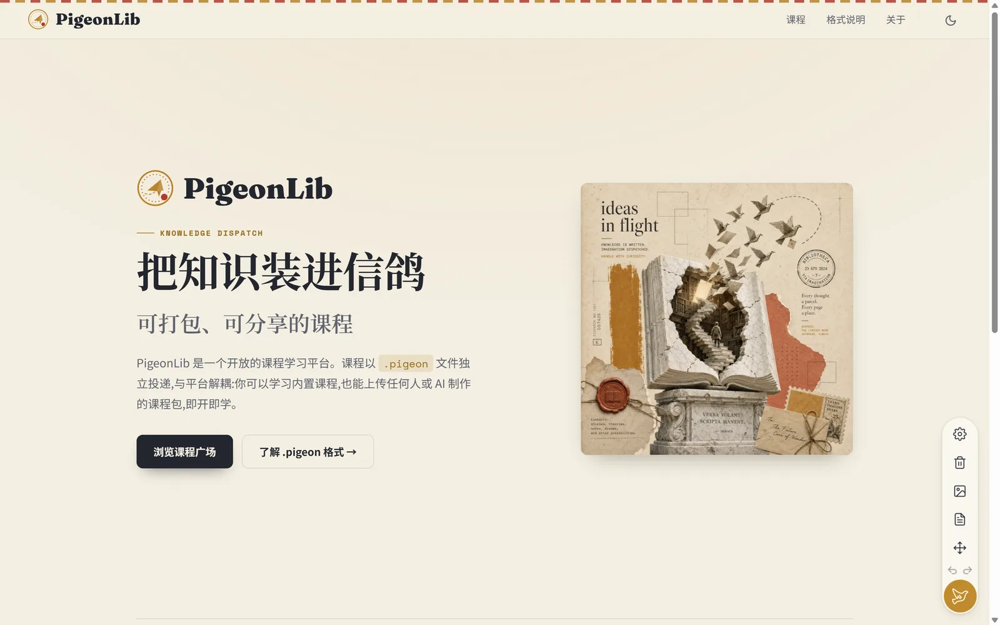
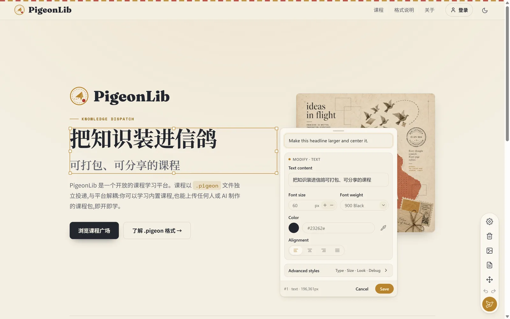
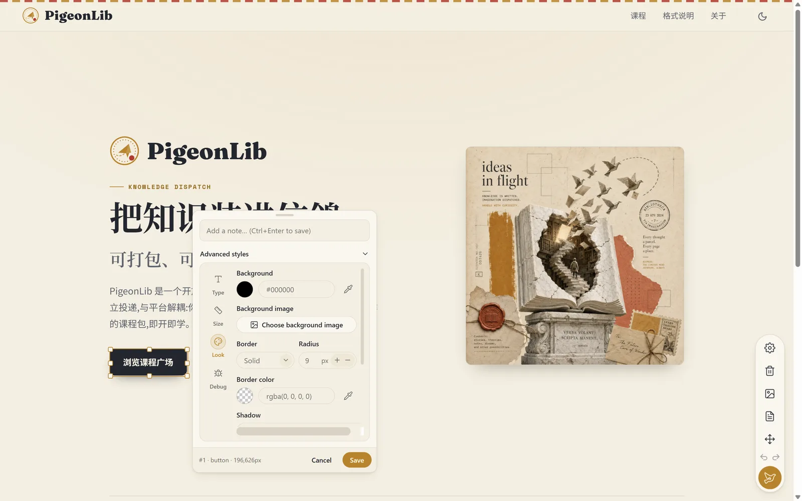
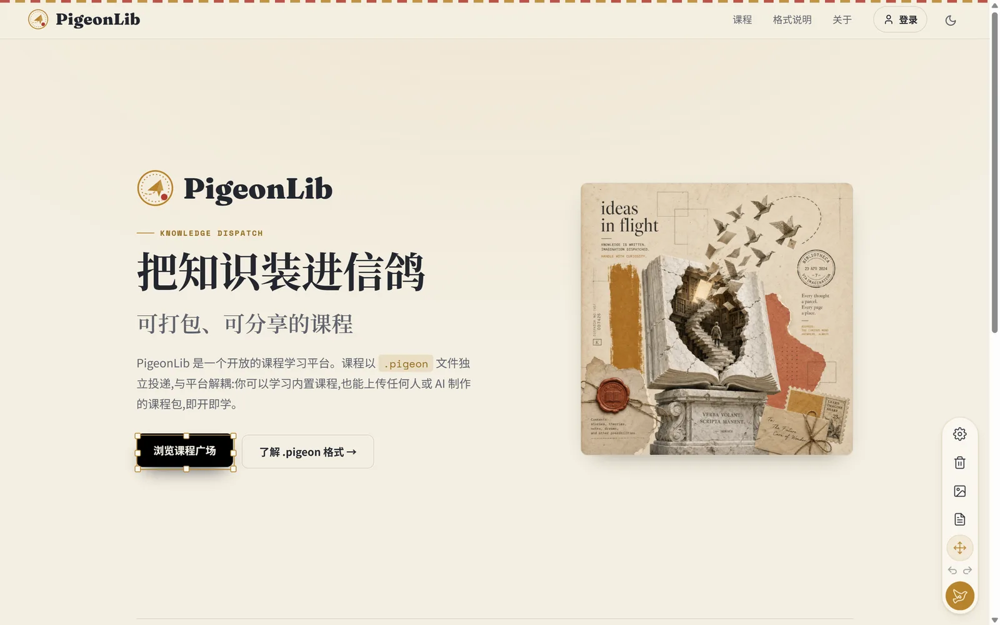
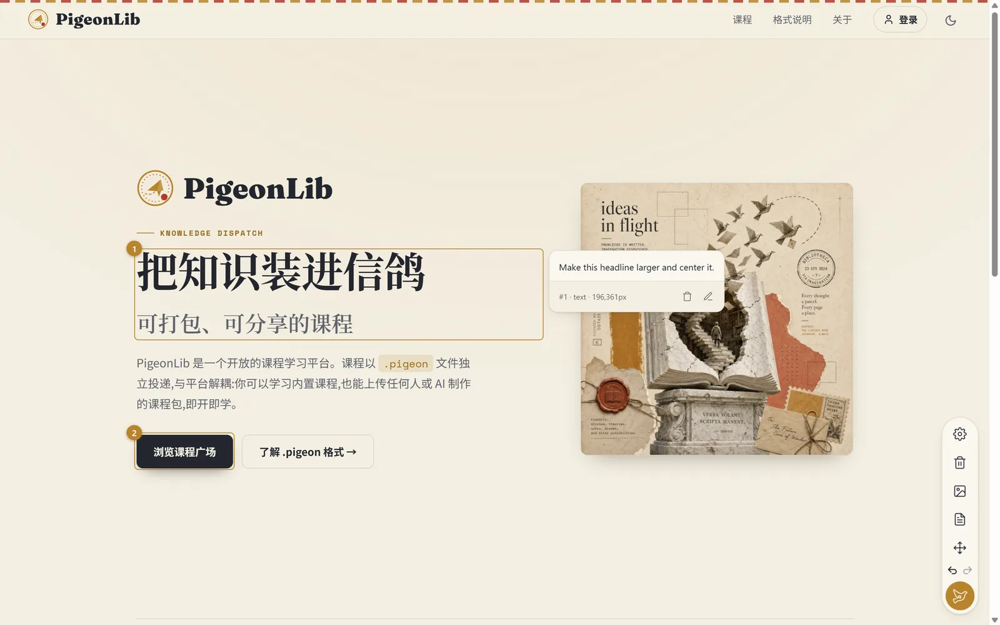
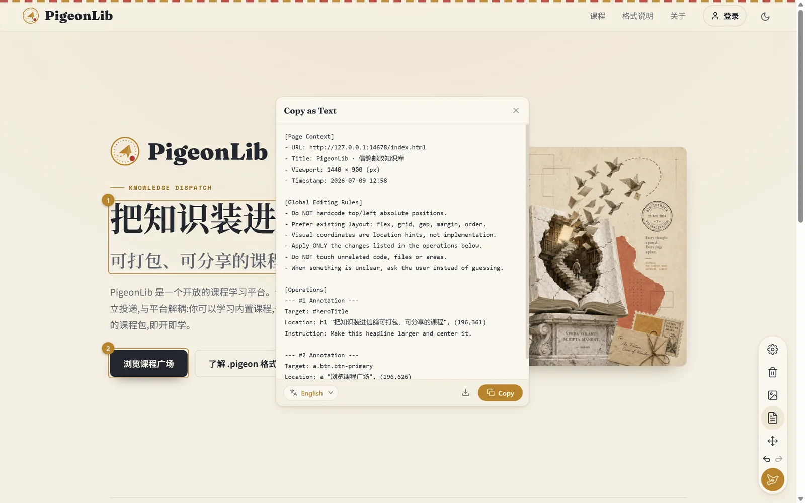

<div align="center">


<p>
  <strong>English</strong>
  &nbsp;·&nbsp;
  <a href="README.zh-CN.md">简体中文</a>
</p>

<p>
  <a href="LICENSE"></a>
  
  
  
  
  
</p>

<p><em>Annotate any web page, edit it in place, then copy a task list your AI coding agent can execute — or a single annotated screenshot.</em></p>

</div>

---

## What is PigeonDeck

**PigeonDeck** is a Chrome / Edge (Manifest V3) browser extension for **web review, UI feedback, and AI-assisted coding handoff**.

Open it on any page and you can annotate elements, box a region, edit text and styles directly in place, and drag components to preview a new layout. When you're done, one click turns everything into either:

- **Copy Text** — a clean, Codex/AI-ready task list (English by default) that describes every change with stable selectors and semantic location hints, so a coding agent can implement it faithfully; or
- **Copy Image** — a single-page long screenshot with your annotations, pins, region boxes, and move arrows drawn on top.

No accounts, no servers, no telemetry. Everything lives in the current tab session.

> **Project status.** PigeonDeck's V1 feature set is code-complete and covered by an automated test suite. It is currently in real-device smoke testing ahead of the Chrome Web Store / Edge Add-ons launch. You can already [run it from source](#install) today.

---

## Why PigeonDeck

Design review and AI coding live in two different places. You *see* what's wrong in the browser, but your coding agent needs it as *words* — precise selectors, before/after values, and layout intent that isn't just "move it 12px left."

PigeonDeck closes that gap. You point at the page; it writes the brief.

- **Visual in, executable out.** Point-and-click on the real page produces a structured, deduplicated task list — not a vague paragraph.
- **Layout-aware by design.** The output explicitly tells the agent *not* to hardcode `top`/`left`, and to prefer `flex` / `grid` / `gap` / `margin` / `order`. Visual coordinates are treated as hints, never as CSS.
- **One element, one instruction.** Annotation + style change + move on the same element are merged into a single operation, so the agent never gets contradictory edits.

---

## Features

| | |
|---|---|
| **Annotate anywhere** | Click any element to attach a note. Elements get a gold pin with a stable number (assigned once, never renumbered). |
| **Region select** | Long-press and drag to box an area; PigeonDeck records the region and the visible elements inside it. |
| **Edit in place** | Double-click text to edit it inline, with a Word-style per-character rich-text bar (font, size, color, weight, decoration). Double-click an image or video to replace it. |
| **Move & snap** | Drag a component to preview a new position, with edge/center snapping and live guides. Eight-handle box for resizing. Alt to move freely. |
| **Copy Text** | Generate a Codex/AI-ready task list: page context, global editing rules, and per-operation instructions with before/after change tables. |
| **Copy Image** | Render a single-page long screenshot with annotations, pins, region boxes, and move arrows composited on top. |

---

## See it in action

> PigeonDeck (English UI) at work on a real site.

<div align="center">

<table>
  <tr>
    <td width="50%"><br><sub><b>The dock.</b> A single-column rail — annotate is the default mode.</sub></td>
    <td width="50%"><br><sub><b>Annotate.</b> Click an element, say what to change.</sub></td>
  </tr>
  <tr>
    <td width="50%"><br><sub><b>Edit styles.</b> Typography, size, appearance, and a debug readout.</sub></td>
    <td width="50%"><br><sub><b>Move &amp; snap.</b> Grab a component with eight resize handles.</sub></td>
  </tr>
  <tr>
    <td width="50%"><br><sub><b>Pins &amp; cards.</b> Numbered pins; open a card to review each note.</sub></td>
    <td width="50%"><br><sub><b>Copy Text.</b> A paste-ready AI task list, built from real selectors.</sub></td>
  </tr>
</table>

</div>

---

## The output

The heart of PigeonDeck is what **Copy Text** produces — a task list designed to be pasted straight into a coding agent:

```text
[Page Context]
- URL: https://example.com/pricing
- Title: Pricing — Acme
- Viewport: 1440 × 900 (px)
- Timestamp: 2026-06-27 16:40

[Global Editing Rules]
- Do NOT hardcode top/left absolute positions.
- Prefer existing layout: flex, grid, gap, margin, order.
- Visual coordinates are location hints, not implementation.
- Change only what the operations below ask for; leave unrelated code untouched.

[Operations]
--- #1 Annotation ---
Target: section.hero > h2
Location: hero title, top center
Instruction: Make the headline more urgent, larger, and centered.

--- #2 Style Modification + Move ---
Target: button.cta
Instruction: Rebrand the primary button to gold, softer radius, add a shadow; move it below the sidebar.
Changes:
  | background-color | #2563eb | #b8842c        |
  | border-radius    | 6px     | 12px           |
  | box-shadow       | none    | 0 1px 3px …    |
Move:
  Source: button.cta
  Target: aside .actions (below)
  Snap: snapped (X center, Y 8px gap)

--- #4 Region ---
Scope: [div.card, img.thumb, span.price]
Coordinates: (320,180)–(720,520)
Instruction: This block feels cramped — give it more breathing room.
```

Prefer a picture? **Copy Image** gives you the same review as a single annotated long screenshot.

---

## Install

### From the store

Chrome Web Store and Edge Add-ons listings are **coming soon**. A self-hosted `.crx` with auto-update is planned alongside the store release.

### From source (available now)

```bash
git clone https://github.com/Pigeon-Pub/PigeonDeck.git
cd PigeonDeck
npm install
npm run build      # outputs to dist/
```

Then load it unpacked:

1. Open `chrome://extensions` (or `edge://extensions`).
2. Enable **Developer mode**.
3. Click **Load unpacked** and select the `dist/` folder.

---

## Quick start

1. **Open the dock.** Click the floating pigeon in the corner of any page — the tool rail expands and you're in annotate mode.
2. **Mark it up.** Click elements to annotate, double-click text to edit, drag to move. Every change is tracked and undoable.
3. **Copy.** Hit **Copy Text** for an AI task list, or **Copy Image** for an annotated screenshot.
4. **Hand it off.** Paste the task list to your coding agent, or drop the image into a review thread.

---

## Architecture & quality

- **Vite + TypeScript + Manifest V3**, multi-entry build (content script + background service worker), `strict` with no unused locals/parameters.
- **Shadow DOM isolation.** All in-page UI lives under one shadow root, split into four layers — Control, Panel, Overlay, Feedback — so PigeonDeck never leaks styles into (or inherits from) the host page.
- **Session-scoped state**, keyed by full URL. Refresh restores locatable content; closing the tab clears it. No storage of page content off-device.
- **Pure-function core.** Selection granularity, snapping, export formatting, and layout math are pure functions with dedicated unit tests.
- **Tested.** Vitest unit tests and Playwright end-to-end tests run against the built extension, plus an i18n consistency check, as merge gates.

---

## Contributing

Contributions are welcome — especially **translations**. PigeonDeck is built to be localized:

1. Copy `public/_locales/en/messages.json` to `public/_locales/<lang>/messages.json`.
2. Translate each `message` field, keeping `placeholders` intact.
3. Register your language in `public/_locales/AVAILABLE_LANGUAGES.json`.
4. Run `npm run i18n:check` and open a PR.

See [`public/_locales/CONTRIBUTING.md`](public/_locales/CONTRIBUTING.md) for the full guide.

For code, the gates are `npm run build`, `npm run typecheck`, `npm test`, `npm run e2e`, and `npm run i18n:check`.

---

## Star history

<div align="center">

<a href="https://star-history.com/#Pigeon-Pub/PigeonDeck&Date">
  
</a>

</div>

If PigeonDeck is useful to you, a star helps others find it.

---

## License

[MIT](LICENSE) © PigeonDeck contributors.

<div align="center"><sub>Annotate the web — hand it to your AI.</sub></div>
