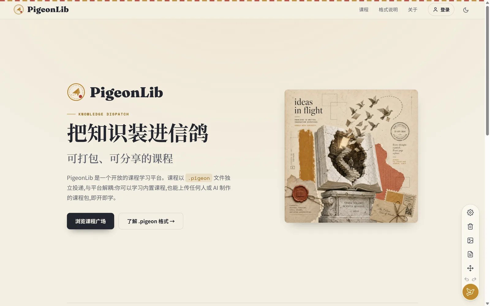
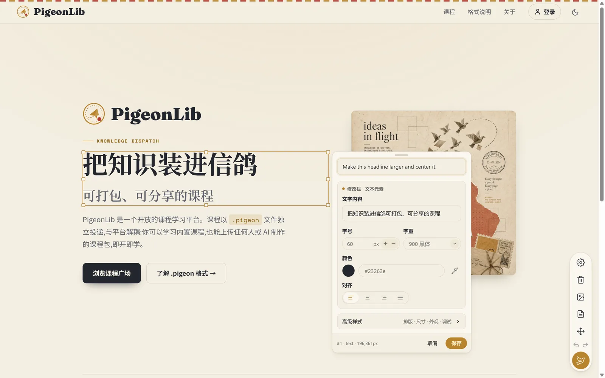
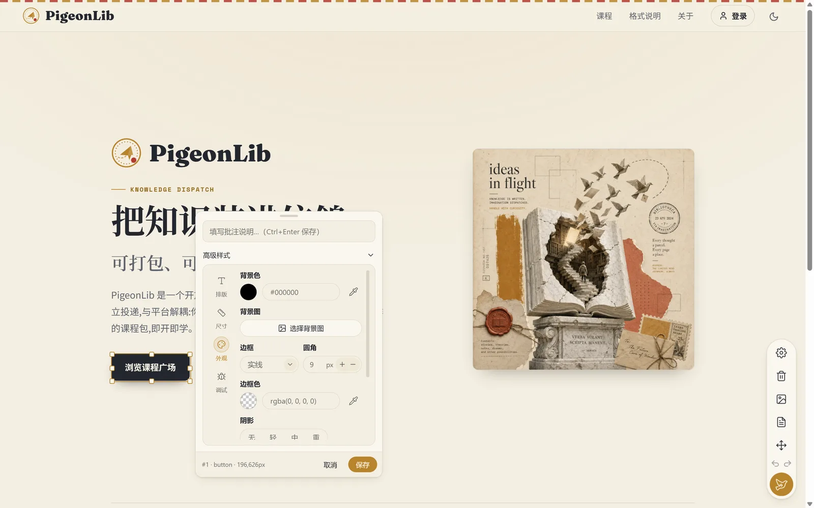
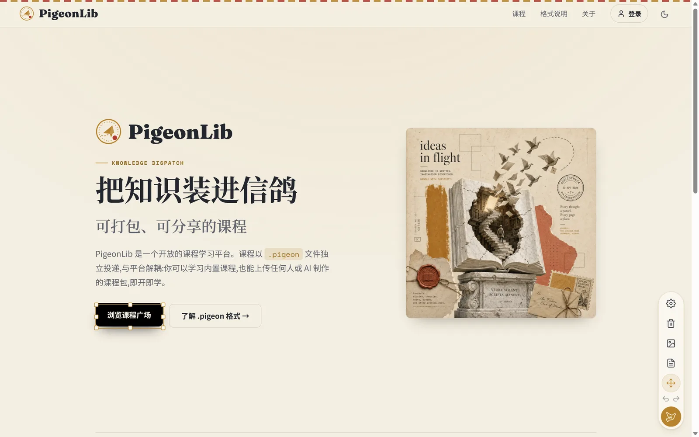
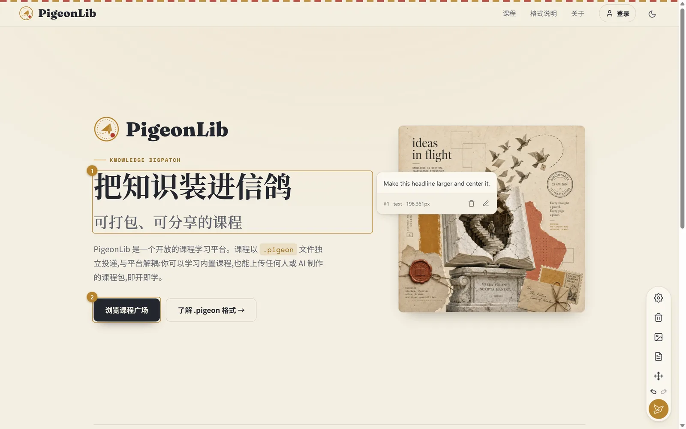
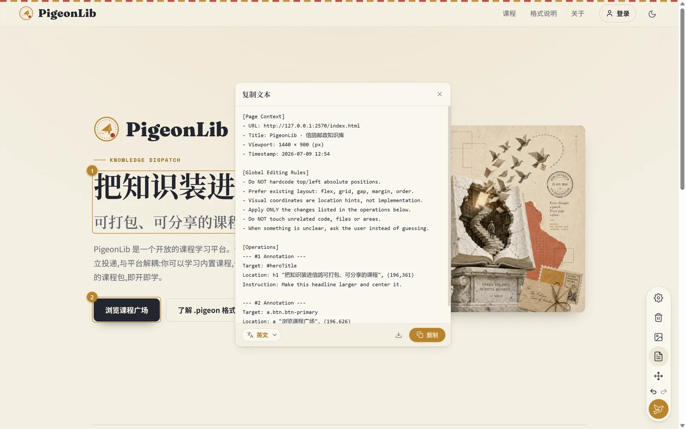

<div align="center">


<p>
  <a href="README.md">English</a>
  &nbsp;·&nbsp;
  <strong>简体中文</strong>
</p>

<p>
  <a href="LICENSE"></a>
  
  
  
  
  
</p>

<p><em>在任意网页上标注、就地编辑，然后一键复制成 AI 编码代理可执行的任务清单——或一张叠好批注的截图。</em></p>

</div>

---

## PigeonDeck 是什么

**PigeonDeck** 是一款面向**网页验收、UI 修改反馈和 AI 编码交付**的 Chrome / Edge（Manifest V3）浏览器扩展。

在任意网页打开它，你可以标注元素、框选区域、就地编辑文字与样式、拖动组件预览新布局。做完后一键即可得到：

- **复制文本** —— 一份干净、Codex/AI 可直接执行的任务清单（默认英文），用稳定的选择器和语义化定位描述每一处改动，让编码代理忠实实现；或
- **复制图片** —— 一张单页长截图，把你的批注、位号、区域框、移动箭头叠在页面上。

无需账号、无服务器、无遥测。所有内容只活在当前标签页会话里。

> **项目状态。** PigeonDeck 的 V1 功能已代码闭环并有自动化测试覆盖，目前正处于真机冒烟阶段，随后将上架 Chrome 网上应用店 / Edge 加载项。你现在就可以[从源码运行](#安装)。

---

## 为什么用 PigeonDeck

设计验收和 AI 编码分处两个世界。问题你在浏览器里一眼**看**得到，但编码代理需要的是**文字**——精确的选择器、前后值，以及"往左挪 12px"之外的真实布局意图。

PigeonDeck 补上这道断层：你在页面上指，它替你写清楚。

- **可视化进，可执行出。** 在真实页面点选，产出结构化、去重后的任务清单，而不是一段含糊的话。
- **天生懂布局。** 输出会明确要求代理**不要**硬编码 `top`/`left`，优先用 `flex` / `grid` / `gap` / `margin` / `order`；视觉坐标只当线索，绝不当 CSS。
- **同一元素，一条指令。** 同一元素上的批注 + 样式修改 + 移动会合并成一条操作，代理不会收到互相矛盾的编辑。

---

## 功能

| | |
|---|---|
| **随处标注** | 单击任意元素挂一条批注。已标注元素显示金色位号圆，编号一经分配固定不变（删除不重排）。 |
| **区域框选** | 长按拖拽框出一片区域，PigeonDeck 记录坐标范围与框内可见元素。 |
| **就地编辑** | 双击文本进入行内编辑，配 Word 式逐字符富文本浮条（字体/字号/颜色/字重/装饰）；双击图片或视频进入替换流程。 |
| **移动与吸附** | 拖动组件预览新位置，带边缘/中心吸附与实时参考线；八向句柄缩放；Alt 自由移动。 |
| **复制文本** | 生成 Codex/AI 可执行的任务清单：页面上下文、全局编辑规则、逐条操作说明 + 前后值变更表。 |
| **复制图片** | 渲染单页长截图，把批注、位号、区域框、移动箭头程序化叠在页面上。 |

---

## 实际界面

> PigeonDeck（中文界面）在真实站点上工作的样子。

<div align="center">

<table>
  <tr>
    <td width="50%"><br><sub><b>工具盘。</b>单列纵向工具栏——展开即默认批注模式。</sub></td>
    <td width="50%"><br><sub><b>标注。</b>单击元素，写下你想要的改动。</sub></td>
  </tr>
  <tr>
    <td width="50%"><br><sub><b>改样式。</b>排版、尺寸、外观，外加调试信息面板。</sub></td>
    <td width="50%"><br><sub><b>移动与吸附。</b>选中组件，带八向缩放句柄。</sub></td>
  </tr>
  <tr>
    <td width="50%"><br><sub><b>位号与卡片。</b>金色位号；点开卡片逐条查看批注。</sub></td>
    <td width="50%"><br><sub><b>复制文本。</b>用真实选择器生成、可直接粘贴的 AI 任务清单。</sub></td>
  </tr>
</table>

</div>

---

## 输出长什么样

PigeonDeck 的核心是**复制文本**产出的东西——一份可直接粘进编码代理的任务清单：

```text
[Page Context]
- URL: https://example.com/pricing
- Title: Pricing — Acme
- Viewport: 1440 × 900 (px)
- Timestamp: 2026-06-27 16:40

[Global Editing Rules]
- Do NOT hardcode top/left absolute positions.
- Prefer existing layout: flex, grid, gap, margin, order.
- Visual coordinates are location hints, not implementation.
- Change only what the operations below ask for; leave unrelated code untouched.

[Operations]
--- #1 Annotation ---
Target: section.hero > h2
Location: hero title, top center
Instruction: Make the headline more urgent, larger, and centered.

--- #2 Style Modification + Move ---
Target: button.cta
Instruction: Rebrand the primary button to gold, softer radius, add a shadow; move it below the sidebar.
Changes:
  | background-color | #2563eb | #b8842c        |
  | border-radius    | 6px     | 12px           |
  | box-shadow       | none    | 0 1px 3px …    |
Move:
  Source: button.cta
  Target: aside .actions (below)
  Snap: snapped (X center, Y 8px gap)

--- #4 Region ---
Scope: [div.card, img.thumb, span.price]
Coordinates: (320,180)–(720,520)
Instruction: This block feels cramped — give it more breathing room.
```

> 输出结构键名恒为英文以对齐编码代理约定；正文可切换中文或跟随界面语言。更想要图？**复制图片**把同一份验收给你一张叠好批注的长截图。

---

## 安装

### 从商店

Chrome 网上应用店与 Edge 加载项上架**即将推出**。上架同期计划提供带自动更新的自托管 `.crx`。

### 从源码（现在即可）

```bash
git clone https://github.com/Pigeon-Pub/PigeonDeck.git
cd PigeonDeck
npm install
npm run build      # 输出到 dist/
```

然后加载已解压的扩展：

1. 打开 `chrome://extensions`（或 `edge://extensions`）。
2. 开启**开发者模式**。
3. 点**加载已解压的扩展程序**，选择 `dist/` 目录。

---

## 快速上手

1. **打开工具盘。** 点击任意页面角落的悬浮鸽——工具栏展开，直接进入批注模式。
2. **动手标注。** 单击元素批注、双击文本编辑、拖动移动。每一步都被记录、可撤销。
3. **复制。** 点**复制文本**得到 AI 任务清单，或**复制图片**得到叠批注的截图。
4. **交出去。** 把任务清单粘给你的编码代理，或把图片丢进验收讨论里。

---

## 架构与质量

- **Vite + TypeScript + Manifest V3**，多入口构建（内容脚本 + 后台 service worker），`strict` 且禁未使用变量/参数。
- **Shadow DOM 隔离。** 所有页面内 UI 挂在单一 shadow root 下，分四层——Control / Panel / Overlay / Feedback——PigeonDeck 既不向宿主页面泄漏样式，也不继承其样式。
- **状态按会话作用域**，以完整 URL 为键。刷新恢复可定位内容，关闭标签页即清空。页面内容不落盘离设备。
- **纯函数内核。** 选择粒度、吸附、导出格式化、布局计算均为纯函数，各有专门单测。
- **有测试。** Vitest 单测与 Playwright 端到端测试针对已构建扩展运行，外加 i18n 一致性校验，均为合并门禁。

---

## 参与贡献

欢迎贡献——尤其是**翻译**。PigeonDeck 为本地化而生：

1. 复制 `public/_locales/en/messages.json` 到 `public/_locales/<语言代码>/messages.json`。
2. 翻译每个 `message` 字段，保持 `placeholders` 结构不变。
3. 在 `public/_locales/AVAILABLE_LANGUAGES.json` 注册你的语言。
4. 运行 `npm run i18n:check` 后提交 PR。

完整指南见 [`public/_locales/CONTRIBUTING.md`](public/_locales/CONTRIBUTING.md)。

代码贡献的门禁为 `npm run build`、`npm run typecheck`、`npm test`、`npm run e2e`、`npm run i18n:check`。

---

## Star 趋势

<div align="center">

<a href="https://star-history.com/#Pigeon-Pub/PigeonDeck&Date">
  
</a>

</div>

如果 PigeonDeck 对你有用，点一个 star 能帮更多人找到它。

---

## 许可证

[MIT](LICENSE) © PigeonDeck contributors.

<div align="center"><sub>在网页上标注，交给你的 AI。</sub></div>
